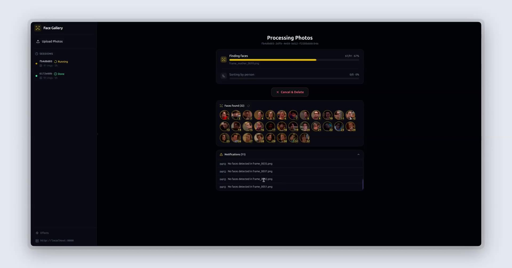

# Face Gallery

An open-source web application for automatically detecting, grouping, and organizing photos by the faces that appear in them. Visualize face-to-photo relationships in an interactive graph, manage faces with merge/rename/disable, and fine-tune detection settings through a polished dark UI.



[Watch the full demo video on Google Drive](https://drive.google.com/file/d/10Zpq7wDfBluFL_LMdAKPqhTmfBKu4r5d/view?usp=sharing)

---

## Features

### Core
- Upload photos or ZIP archives with drag-and-drop
- Two-step ML pipeline: detect unique faces, then sort all photos by person
- Real-time processing progress via WebSocket
- Results in **List View** (face cards with photo grids) and **Graph View** (interactive node network)

### Graph Visualization
- **Square layout** — photos in a grid, faces distributed evenly on all 4 sides
- **Radial layout** — photos packed in a spiral, faces on the outer ring
- Face-to-photo connection lines with hover highlighting
- Drag, zoom, pan, fullscreen, and minimap
- Double-click any photo to manage face assignments

### Face Management
- **Faces Manager** dialog — bulk select, merge, disable, enable, delete faces
- **Reversible merge** — faces are grouped (not deleted), can be ungrouped or have their display photo changed at any time
- **Rename/tag** faces inline with click-to-edit
- **Disable** faces to hide them from results without deleting
- **Hover preview** on all face avatars and photo thumbnails (enlarged popup)

### Manual Face Assignment
- Click "Edit Faces" on any photo to add or remove face associations
- **Draw bounding box** — when adding a face, draw a rectangle on the image to mark the face location
- Skip drawing to assign without a box

### Performance
- **Server-side thumbnails** — on-the-fly JPEG thumbnail generation with disk caching
- **Granular visual effects** — toggle edge animations, glow, shadows, hover effects, transitions, and minimap independently
- Smart recommendation after processing 30+ images to disable heavy effects
- All grid/list views use thumbnails; full-res only loaded on demand

### Session Management
- Add more images to existing sessions and re-process
- Cancel and delete sessions (removes all data and files)
- Configurable backend URL with connection test
- **Processing settings** — adjust face crop padding (with live preview) and match tolerance before processing

---

## Tech Stack

| Layer | Technology |
|---|---|
| Frontend | React 19, TypeScript, Vite, Tailwind CSS |
| State | Zustand + TanStack React Query |
| Graph | @xyflow/react (ReactFlow) |
| Animation | Framer Motion |
| Backend | Python 3.12, FastAPI, Uvicorn |
| Database | SQLite + SQLAlchemy |
| Face ML | face_recognition (dlib), OpenCV |
| Realtime | WebSocket |

---

## Prerequisites

- **Python 3.10+**
- **Node.js 18+** and npm
- **CMake** and a C++ compiler (required to build dlib)

### Installing dlib build dependencies

**Ubuntu / Debian**
```bash
sudo apt update
sudo apt install -y cmake build-essential libopenblas-dev liblapack-dev libx11-dev
```

**macOS (Homebrew)**
```bash
brew install cmake
```

**Windows**

Install [CMake](https://cmake.org/download/) and [Visual Studio Build Tools](https://visualstudio.microsoft.com/visual-cpp-build-tools/) with the "Desktop development with C++" workload.

---

## Quick Start

### 1. Clone the repo

```bash
git clone https://github.com/mrbeandev/Face-Gallery.git
cd Face-Gallery
```

### 2. Start the backend

```bash
cd face-detection-webapp/backend

# Create and activate a virtual environment
python3 -m venv venv
source venv/bin/activate        # macOS / Linux
# venv\Scripts\activate         # Windows

# Install dependencies
pip install -r requirements.txt

# Start the API server
uvicorn main:app --reload --host 0.0.0.0 --port 8000
```

The API is now running at `http://localhost:8000`.

### 3. Start the frontend

Open a second terminal:

```bash
cd face-detection-webapp/frontend

npm install
npm run dev
```

The app is now running at `http://localhost:5173`.

### 4. Connect

Open `http://localhost:5173` in your browser. On first launch you'll be prompted to enter the backend URL (defaults to `http://localhost:8000`). Click **Test & Connect** to verify.

> The Vite dev server proxies `/api`, `/ws`, `/thumb`, and `/static` requests to the backend automatically.

---

## Usage

1. **Upload** — drag and drop images or a ZIP archive onto the upload area
2. **Configure** — click "Processing Settings" below the upload button to adjust crop padding and match tolerance
3. **Process** — photos are uploaded and processing starts automatically. Watch real-time progress with live face discovery
4. **Results** — browse detected faces in List or Graph view
5. **Manage faces** — click "Faces" in the header to rename, merge, disable, delete, or change display photos
6. **Edit assignments** — click "Edit Faces" on any photo to add/remove faces with optional bounding box drawing
7. **Filter** — in Graph view, open the Filter panel to show/hide specific faces, toggle between gray-out and hide modes
8. **Add images** — click "+ Add Images" to upload more photos to an existing session and re-process
9. **Effects** — click "Effects" in the sidebar to toggle visual effects for performance tuning

---

## Standalone Scripts

For batch processing without the web UI:

| Script | Purpose |
|---|---|
| `part1.py` | Scan `input/` and extract unique faces into `UNIQUE/` |
| `part2.py` | Copy images from `input/` into `sorted_by_face/{id}/` folders |

```bash
pip install -r requirements.txt
# Drop photos into input/, then:
python part1.py
python part2.py
```

---

## Project Structure

```
Face-Gallery/
├── part1.py                            # Standalone face extraction
├── part2.py                            # Standalone photo sorting
├── requirements.txt                    # Standalone dependencies
│
└── face-detection-webapp/
    ├── backend/
    │   ├── main.py                     # FastAPI app, CORS, thumbnails, settings
    │   ├── database.py                 # SQLAlchemy models + migrations
    │   ├── processing.py               # Background ML pipeline
    │   ├── schemas.py                  # Pydantic response schemas
    │   ├── requirements.txt            # Python dependencies
    │   └── routers/
    │       ├── jobs.py                 # REST endpoints (upload, process, faces, merge, etc.)
    │       └── ws.py                   # WebSocket progress streaming
    │
    └── frontend/
        ├── public/
        │   └── face-sample.png         # Sample face for settings preview
        ├── src/
        │   ├── App.tsx                 # Router + layout wrapper
        │   ├── api/client.ts           # Axios API client with dynamic base URL
        │   ├── components/
        │   │   ├── BackendSetup.tsx     # Backend URL configuration modal
        │   │   ├── EffectsDialog.tsx    # Granular visual effects toggles
        │   │   ├── Layout.tsx          # Sidebar, header, resizable panels
        │   │   └── SettingsPopover.tsx  # Crop padding + tolerance settings
        │   ├── hooks/useJobWS.ts       # WebSocket hook
        │   ├── pages/
        │   │   ├── Upload.tsx          # Upload + settings
        │   │   ├── Processing.tsx      # Live progress + cancel
        │   │   └── Results.tsx         # List/Graph views, face management
        │   ├── store/
        │   │   ├── jobStore.ts         # Processing state
        │   │   └── settingsStore.ts    # Backend URL + effects config
        │   └── types.ts                # WebSocket event types
        ├── package.json
        ├── vite.config.ts
        └── tailwind.config.js
```

---

## API Reference

### Jobs

| Method | Endpoint | Description |
|---|---|---|
| `POST` | `/api/jobs/upload` | Upload images or ZIP, create new job |
| `POST` | `/api/jobs/{id}/add-images` | Add more images to existing job |
| `GET` | `/api/jobs` | List recent jobs |
| `GET` | `/api/jobs/{id}` | Get job details |
| `POST` | `/api/jobs/{id}/start` | Start processing |
| `POST` | `/api/jobs/{id}/stop` | Stop processing |
| `DELETE` | `/api/jobs/{id}` | Delete job and all data |
| `GET` | `/api/jobs/{id}/results` | Get results (list + graph data) |

### Face Management

| Method | Endpoint | Description |
|---|---|---|
| `PATCH` | `/api/jobs/{id}/faces/{faceId}` | Rename a face |
| `POST` | `/api/jobs/{id}/faces/merge` | Group faces (reversible merge) |
| `POST` | `/api/jobs/{id}/faces/{faceId}/ungroup` | Remove face from group |
| `POST` | `/api/jobs/{id}/faces/group/{groupId}/set-primary` | Change group display face |
| `POST` | `/api/jobs/{id}/faces/{faceId}/disable` | Toggle face disabled state |
| `DELETE` | `/api/jobs/{id}/faces/{faceId}` | Permanently delete a face |

### Image-Face Assignment

| Method | Endpoint | Description |
|---|---|---|
| `POST` | `/api/jobs/{id}/images/{imgId}/faces/{faceId}` | Assign face to image (with optional bounding box) |
| `DELETE` | `/api/jobs/{id}/images/{imgId}/faces/{faceId}` | Remove face from image |

### Other

| Method | Endpoint | Description |
|---|---|---|
| `WS` | `/ws/{id}` | Real-time processing progress |
| `GET` | `/thumb/{path}?size=200` | On-the-fly thumbnail generation |
| `GET` | `/api/settings` | Get processing settings |
| `PUT` | `/api/settings` | Update crop padding / tolerance |
| `GET` | `/health` | Health check |

---

## Configuration

Settings are configurable at runtime through the UI. No `.env` file required.

| Setting | Where to change | Default | Description |
|---|---|---|---|
| Backend URL | Sidebar footer or first-launch dialog | `http://localhost:8000` | Backend API endpoint |
| Face Crop Padding | Upload page > Processing Settings | 45% | Extra space around detected faces when cropping |
| Match Tolerance | Upload page > Processing Settings | 0.50 | Face matching strictness (lower = stricter) |
| Visual Effects | Sidebar > Effects | All on | Toggle animations, glow, shadows, hover, minimap |
| CORS origins | `backend/main.py` | `localhost:5173` | Add origins for production |

---

## Production Deployment

```bash
# Build the frontend
cd face-detection-webapp/frontend
npm run build

# Serve with a production ASGI server
cd ../backend
pip install gunicorn
gunicorn main:app -w 4 -k uvicorn.workers.UvicornWorker --bind 0.0.0.0:8000
```

Point your reverse proxy (nginx, Caddy, etc.) at port 8000 and serve `frontend/dist/` as static files. Remember to update CORS origins in `main.py` for your domain.

---

## Contributing

Contributions, bug reports, and feature requests are welcome. Please open an issue before submitting a large pull request so we can discuss the approach.

1. Fork the repo
2. Create a feature branch: `git checkout -b feature/your-feature`
3. Commit your changes
4. Push and open a pull request

---

## License

MIT -- see [LICENSE](LICENSE) for details.
